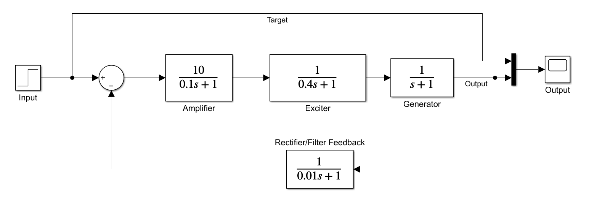
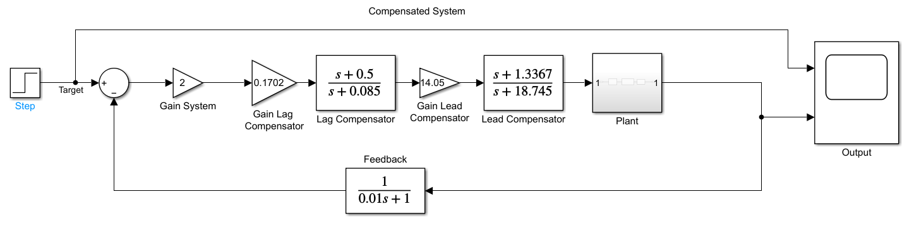

# AVR System Lag Lead Compensation for Synchronous Generators via Bode Plot

This repository contains the modeling, analysis, and design of an **Automatic Voltage Regulator (AVR)** control system for synchronous generators. This project focuses on improving transient response performance and stability using a **Lag-Lead Compensator** designed via the **Bode Plot** method in both continuous and discrete-time domains.

## **Abstract**
An Automatic Voltage Regulator (AVR) is a control system used to maintain a stable generator output voltage by regulating excitation. This project evaluates system performance using step response, Bode plot, Root Locus, and Nyquist plot analysis. Initial analysis showed the uncompensated system exhibited poor performance with a **65.2% overshoot**. By implementing a **Lag-Lead Compensator**, the system achieved significantly better stability and faster recovery speed.

## **System Modeling**
The system is modeled as a closed-loop feedback system with the following subsystems:

* **Amplifier**: $G_A(s) = \frac{10}{0.1s + 1}$ with gain $k_a = 10$ and time constant $\tau_a = 0.1$ s.
* **Exciter**: $G_E(s) = \frac{1}{0.4s + 1}$ with gain $k_e = 1$ and time constant $\tau_e = 0.4$ s.
* **Generator**: $G_{gen}(s) = \frac{1}{s + 1}$ with gain $k_g = 1$ and time constant $\tau_g = 1$ s.
* **Sensor**: $G_S(s) = \frac{1}{0.01s + 1}$ with gain $k_s = 1$ and time constant $\tau_s = 0.01$ s.

## **Performance Comparison**
The following table summarizes the response criteria before and after applying the Lag-Lead compensation:

| Criteria | Uncompensated Value | Compensated Value |
| :--- | :---: | :---: |
| **Peak Time (Tp)** | 0.75 s | 0.4983 s |
| **Settling Time (Ts)** | 5.5744 s | 2.532 s |
| **Overshoot (%OS)** | 65.2% | 2.7349% |
| **Steady State Error (ess)** | 0.0907 | 0.0476 |

# Compensated Block Diagram

## **Digital Control (Discrete-Time Analysis)**

The system was discretized using the **Zero-Order Hold (ZOH)** method with a sampling time ($T_s$) of **0.01 s** to evaluate digital control performance.

* **Stability Range**: The discrete system remains stable within the range of $0.0010 \text{ s} \le T_s \le 0.1610 \text{ s}$.
* **Sampling Effects**: The discrete system exhibits a slightly higher overshoot (**5.7%**) compared to the continuous model due to signal retention effects.
* **Frequency Characteristics**: At low-medium frequencies, the discrete model accurately reflects the continuous system gain.

## **Technologies Used**
* **MATLAB & Simulink**: For modeling, transient response simulation, and discretization.
* **Control System Engineering**: Frequency domain (Bode, Nyquist) and Root Locus stability analysis.

## **Authors**
* **Nahiza Hazim Valensi Miriandran** (18023021)
* **Adhindamuthia Ramadhiani** (18023023)
* **Gabriella Surjana** (18023043)

*Electrical Power Engineering, Bandung Institute of Technology (ITB).*
